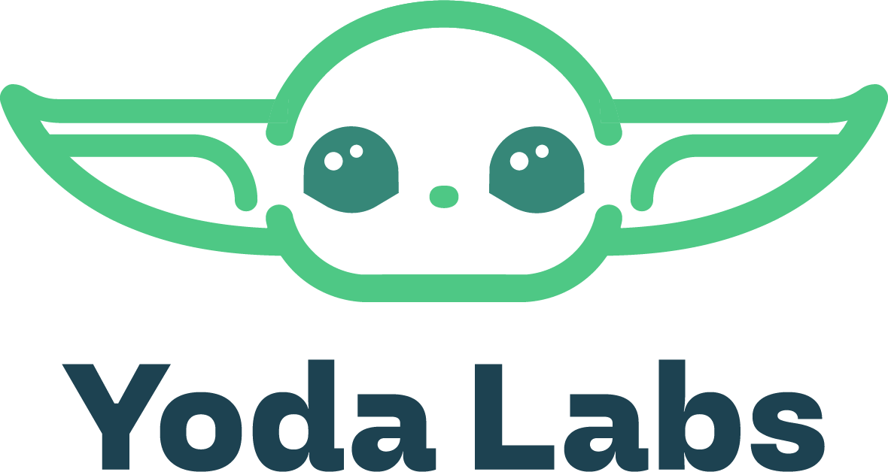

<p align="center">
  
</p>


<p align="center">
  <strong>Sistema de Monitoreo de Lotes Agrícolas</strong><br>
  Backend REST desarrollado con Node.js + Express + persistencia en JSON
</p>

## Enlaces del proyecto

| Recurso | Enlace |
|---|---|
| Carpeta de Drive | [Ver carpeta](https://drive.google.com/drive/folders/1nP6_cLk0gUn7UZyzWcVD0ra8DfMDtz7u?usp=drive_link) |
| Repositorio GitHub | [Repo-Backend_2A (rama V.2.0)](https://github.com/LeonelDiaz225/Repo-Backend_2A.git) |
| Video de presentación | [Ver video](https://drive.google.com/file/d/11ptcZBzg4-73S4NdhNjsyby75fSDdKb5/view?usp=drive_link) |

---

## Índice

1. [Descripción general](#-descripción-general)
2. [Problemática que resuelve](#-problemática-que-resuelve)
3. [Tecnologías utilizadas](#-tecnologías-utilizadas)
4. [Arquitectura y organización del proyecto](#-arquitectura-y-organización-del-proyecto)
5. [Estructura de carpetas](#-estructura-de-carpetas)
6. [Instalación y ejecución](#-instalación-y-ejecución)
7. [Modelo de datos](#-modelo-de-datos)
8. [Endpoints de la API](#-endpoints-de-la-api)
9. [Vistas con Pug (Server-Side Rendering)](#-vistas-con-pug-server-side-rendering)
10. [Consultas destacadas](#-consultas-destacadas)
11. [Reglas de negocio y validaciones](#-reglas-de-negocio-y-validaciones)
12. [Manejo de errores y códigos HTTP](#-manejo-de-errores-y-códigos-http)
13. [Pruebas de endpoints](#-pruebas-de-endpoints)
14. [Integrantes y responsabilidades](#-integrantes-y-responsabilidades)
15. [Próximas mejoras](#-próximas-mejoras)

---

## Descripción general

**AgroTec** es una empresa que brinda servicios de monitoreo a productores agrícolas. Este proyecto implementa el **backend funcional** de un sistema que reemplaza el registro manual en papel y planillas aisladas, centralizando la información de:

- **Productores** y sus establecimientos
- **Lotes** asociados a cada productor
- **Técnicos** de campo
- **Tipos de cultivo** (catálogo base)
- **Observaciones** realizadas por los técnicos, con historial trazable por lote

El sistema expone una **API REST** para consumo de servicios y vistas básicas renderizadas con **Pug**.

---

## Problemática que resuelve

Los técnicos de AgroTec registraban información en **papel** y luego la volcaban en **planillas dispersas**, lo que dificultaba:

- Consultar el historial de cada lote
- Detectar lotes con alertas agronómicas
- Mantener trazabilidad de las observaciones

Esta solución **centraliza los datos**, garantiza la **integridad referencial** y conserva el **historial histórico** mediante borrado lógico (*soft delete*).

---

## Tecnologías utilizadas

| Tecnología | Rol en el proyecto |
|---|---|
| **Node.js** | Entorno de ejecución del servidor |
| **Express.js** | Framework para la API REST, ruteo modular y middlewares |
| **Pug** | Motor de plantillas server-side para vistas básicas |
| **fs / path** (nativos de Node) | Lectura/escritura de archivos JSON y manejo de rutas |
| **JSON** | Formato de persistencia local |
| **JavaScript ES6+ (CommonJS)** | POO, herencia y modularización |
| **npm** | Gestión de dependencias y scripts |
| **Postman / Thunder Client** | Testing manual de endpoints |
| **Git / GitHub** | Control de versiones y colaboración |

---

## Arquitectura y organización del proyecto

El proyecto sigue un patrón **MVC (Modelo – Vista – Controlador)** complementado con principios de **Programación Orientada a Objetos**:

- **Clase base `Persona`** → heredada por `Productor` y `Tecnico`
- **Clase genérica `JsonManager`** → capa transversal de persistencia (lectura/escritura/IDs incrementales)
- **Modelos de dominio** (`Lote`, `Observacion`, `TipoCultivo`) → encapsulan validaciones propias

| Elemento | Función |
|---|---|
| `app.js` | Configura Express, Pug, middlewares, rutas, manejo de errores e inicio del servidor |
| `routes/` | Define endpoints y métodos HTTP por recurso |
| `controllers/` | Procesa peticiones, valida datos y devuelve respuestas HTTP |
| `models/` | Clases del sistema + lógica de acceso/persistencia |
| `data/` | Archivos JSON de persistencia local |
| `views/` | Plantillas Pug para las vistas del navegador |
| `package.json` | Metadatos, scripts y dependencias |

---

## Estructura de carpetas

```
Repo-Backend_2A-V.2.0/
├── assets/
├── controllers/
│   ├── lotesController.js
│   ├── observacionesController.js
│   ├── productoresController.js
│   ├── tecnicosController.js
│   └── tiposCultivoController.js
├── data/
│   ├── lotes.json
│   ├── observaciones.json
│   ├── productores.json
│   ├── tecnicos.json
│   └── tipos_cultivo.json
├── models/
│   ├── JsonManager.js
│   ├── Lote.js
│   ├── Observacion.js
│   ├── Persona.js
│   ├── Productor.js
│   ├── Tecnico.js
│   └── TipoCultivo.js
├── routes/
│   ├── lotesRoutes.js
│   ├── observacionesRoutes.js
│   ├── productoresRoutes.js
│   ├── tecnicosRoutes.js
│   └── tiposCultivoRoutes.js
├── views/
│   ├── index.pug
│   ├── lote_detalle.pug
│   └── lotes.pug
├── .gitignore
├── app.js
├── package-lock.json
├── package.json
└── README.md
```

---

## Instalación y ejecución

### 1. Clonar el repositorio

```bash
git clone https://github.com/LeonelDiaz225/Repo-Backend_2A.git
cd Repo-Backend_2A
```

> El proyecto está disponible en la rama **`V.2.0`**.

### 2. Instalar dependencias

```bash
npm install
```

### 3. Ejecutar el servidor

```bash
npm start
```

El servidor quedará disponible en:

```
http://localhost:3000
```

---

## Modelo de datos

Los datos se almacenan localmente en archivos JSON dentro de `data/`. La clase `JsonManager` se encarga de leer, escribir y generar IDs incrementales de forma **sincrónica** (`readFileSync` / `writeFileSync`).

### `productores.json`

```json
[
  {
    "id": 1,
    "nombre": "Juan",
    "apellido": "Pérez",
    "telefono": "1122334455",
    "email": "juan.perez@agrotec.com",
    "establecimiento": "Estancia El Ombú"
  }
]
```

### `lotes.json`

```json
[
  {
    "id": 1,
    "nombre_numero": "Lote 45 Sur",
    "id_productor": 1
  },
  {
    "id": 2,
    "nombre_numero": "Lote 99 Norte",
    "id_productor": 1
  }
]
```

### `tecnicos.json`

```json
[
  {
    "id": 1,
    "nombre": "Juan",
    "apellido": "Pérez",
    "telefono": "1144556677",
    "email": "juan.tecnico@agrotec.com",
    "especialidad": "Agronomía general"
  },
  {
    "id": 2,
    "nombre": "María",
    "apellido": "Gómez",
    "telefono": "1188990011",
    "email": "maria.gomez@agrotec.com",
    "especialidad": "Control de plagas"
  }
]
```

### `tipos_cultivo.json`

```json
[
  { "id": 1, "nombre": "Soja" },
  { "id": 2, "nombre": "Maíz" },
  { "id": 3, "nombre": "Trigo" }
]
```

### `observaciones.json`

```json
[
  {
    "id": 1,
    "id_lote": 1,
    "id_tecnico": 1,
    "fecha": "2026-09-10",
    "tipo_cultivo": "Soja",
    "estado_cultivo": "En crecimiento",
    "observaciones": "Se detectó leve sequía en el sector norte.",
    "nivel_alerta": "Atención",
    "activa": true
  },
  {
    "id": 2,
    "id_lote": 1,
    "id_tecnico": 1,
    "fecha": "2026-09-15",
    "tipo_cultivo": "Soja",
    "estado_cultivo": "Brote",
    "observaciones": "Nivel de humedad adecuado.",
    "nivel_alerta": "Normal",
    "activa": true
  },
  {
    "id": 3,
    "id_lote": 1,
    "id_tecnico": 1,
    "fecha": "2026-09-16",
    "tipo_cultivo": "Soja",
    "estado_cultivo": "Brote",
    "observaciones": "Nivel de humedad adecuado.",
    "nivel_alerta": "Crítico",
    "activa": false
  }
]
```

> **Soft delete**: el campo `activa: false` indica que la observación fue "eliminada" lógicamente. Las consultas (`getAll`, `getById`, `getByLote`, `getByNivelAlerta`) filtran automáticamente los registros con `activa === false`.

---

## Endpoints de la API

### Productores — `/api/productores`

| Método | Endpoint | Body | Descripción |
|---|---|---|---|
| GET | `/api/productores` | — | Lista todos los productores |
| GET | `/api/productores/:id` | — | Obtiene un productor por ID |
| POST | `/api/productores` | `{ nombre, apellido, telefono, email, establecimiento }` | Registra un nuevo productor |
| PUT | `/api/productores/:id` | `{ nombre, apellido, telefono, email, establecimiento }` | Actualiza un productor |
| DELETE | `/api/productores/:id` | — | Elimina un productor |

### Lotes — `/api/lotes`

| Método | Endpoint | Body / Query | Descripción |
|---|---|---|---|
| GET | `/api/lotes` | `?alerta=Normal\|Atención\|Crítico` | Lista lotes (admite filtro por nivel de alerta) |
| GET | `/api/lotes/:id` | — | Obtiene un lote por ID |
| GET | `/api/lotes/:id/observaciones` | — | Historial cronológico de observaciones del lote |
| POST | `/api/lotes` | `{ nombre_numero, id_productor }` | Crea un lote (valida que el productor exista) |
| PUT | `/api/lotes/:id` | `{ nombre_numero, id_productor }` | Actualiza un lote |
| DELETE | `/api/lotes/:id` | — | Elimina un lote |

### Observaciones — `/api/observaciones`

| Método | Endpoint | Body | Descripción |
|---|---|---|---|
| GET | `/api/observaciones` | — | Lista observaciones activas |
| GET | `/api/observaciones/:id` | — | Obtiene una observación activa por ID |
| POST | `/api/observaciones` | `{ id_lote, id_tecnico, fecha, tipo_cultivo, estado_cultivo, observaciones, nivel_alerta }` | Registra una observación |
| DELETE | `/api/observaciones/:id` | — | Borrado lógico (*soft delete*) |

### Técnicos — `/api/tecnicos`

| Método | Endpoint | Body | Descripción |
|---|---|---|---|
| GET | `/api/tecnicos` | — | Lista todos los técnicos |
| GET | `/api/tecnicos/:id` | — | Obtiene un técnico por ID |
| POST | `/api/tecnicos` | `{ nombre, apellido, telefono, email, especialidad }` | Registra un técnico |
| PUT | `/api/tecnicos/:id` | `{ nombre, apellido, telefono, email, especialidad }` | Actualiza un técnico |
| DELETE | `/api/tecnicos/:id` | — | Elimina un técnico |

### Tipos de cultivo — `/api/tipos-cultivo`

| Método | Endpoint | Body | Descripción |
|---|---|---|---|
| GET | `/api/tipos-cultivo` | — | Obtiene el catálogo completo |
| GET | `/api/tipos-cultivo/:id` | — | Obtiene un tipo por ID |
| POST | `/api/tipos-cultivo` | `{ nombre }` | Agrega un tipo de cultivo |
| PUT | `/api/tipos-cultivo/:id` | `{ nombre }` | Modifica un tipo de cultivo |
| DELETE | `/api/tipos-cultivo/:id` | — | Elimina un tipo de cultivo |

---

## Vistas con Pug (Server-Side Rendering)

| Ruta | Vista | Descripción |
|---|---|---|
| `GET /` | `index.pug` | Página de bienvenida a AgroTec |
| `GET /vista/lotes` | `lotes.pug` | Tabla con listado general de lotes |
| `GET /vista/lotes/:id` | `lote_detalle.pug` | Ficha del lote + historial de observaciones activas |

La vista `lote_detalle.pug` aplica estilos CSS según el nivel de alerta:
- 🟢 `Normal`
- 🟠 `Atención`
- 🔴 `Crítico`

> 
> 

---

## Consultas destacadas

El sistema implementa las siguientes consultas específicas solicitadas por el negocio:

### 1. Historial de observaciones por lote

```
GET /api/lotes/:id/observaciones
```

Devuelve todas las observaciones **activas** asociadas al lote indicado.

### 2. Búsqueda de lotes por nivel de alerta

```
GET /api/lotes?alerta=Crítico
```

Filtra los lotes que tengan al menos una observación activa con el nivel de alerta indicado.

### 3. Consulta de observaciones activas

```
GET /api/observaciones
```

Devuelve únicamente las observaciones cuyo campo `activa` sea `true`, respetando el borrado lógico.

---

## Reglas de negocio y validaciones

### Capa de dominio (POO)

- **`Persona`**: `nombre` y `apellido` deben ser strings no vacíos.
- **`Lote`**: `nombre_numero` válido + `id_productor` numérico obligatorio.
- **`TipoCultivo`**: `nombre` no puede estar en blanco.

### Integridad referencial (controllers)

- **Lote → Productor**: se valida que el `id_productor` exista antes de crear o modificar un lote.
- **Observación → Lote / Técnico / TipoCultivo**: se validan secuencialmente:
  - El `id_lote` debe existir.
  - El `id_tecnico` debe existir.
  - El `tipo_cultivo` debe estar en el catálogo.
- **Fecha**: se valida con `Date.parse(fecha)`.
- **Nivel de alerta**: solo se admiten `"Normal"`, `"Atención"` o `"Crítico"`.
- **Inmutabilidad de auditoría**: las observaciones **no se eliminan físicamente**; se aplica *soft delete* asignando `activa: false`.

---

## Manejo de errores y códigos HTTP

| Código | Situación |
|---|---|
| **200 OK** | Consultas y actualizaciones exitosas |
| **201 Created** | Creación exitosa de un recurso |
| **400 Bad Request** | Falta de campos obligatorios, tipos incorrectos, alertas inválidas o violación de integridad referencial |
| **404 Not Found** | Recurso inexistente por `:id` o ruta no encontrada (middleware global) |
| **500 Internal Server Error** | Excepciones no controladas o fallos de lectura/escritura (middleware global) |

Todas las respuestas de error se devuelven en formato JSON:

```json
{ "error": "Descripción del error" }
```

---

## Pruebas de endpoints

Las pruebas se realizaron con **Postman** y **Thunder Client**. Algunos casos verificados:

### Crear lote (éxito)

- **Endpoint**: `POST /api/lotes`
- **Body**:
```json
{ "nombre_numero": "Lote 99 Norte", "id_productor": 1 }
```
- **Respuesta**: `201 Created`

### Crear lote con productor inexistente

- **Endpoint**: `POST /api/lotes`
- **Body**:
```json
{ "nombre_numero": "Lote 99 Este", "id_productor": 5 }
```
- **Respuesta**: `400 Bad Request`
```json
{ "error": "El id_productor proporcionado no existe" }
```

### Registrar observación

- **Endpoint**: `POST /api/observaciones`
- **Body**:
```json
{
  "id_lote": 1,
  "id_tecnico": 1,
  "fecha": "2026-09-15",
  "tipo_cultivo": "Soja",
  "estado_cultivo": "Brote",
  "observaciones": "Nivel de humedad adecuado.",
  "nivel_alerta": "Normal"
}
```
- **Respuesta**: `201 Created`

### Registrar observación con alerta inválida

- **Respuesta**: `400 Bad Request`
```json
{ "error": "El nivel_alerta debe ser \"Normal\", \"Atención\" o \"Crítico\"" }
```

### Registrar observación sin fecha

- **Respuesta**: `400 Bad Request`
```json
{ "error": "id_lote, id_tecnico, fecha, tipo_cultivo y nivel_alerta son obligatorios" }
```

### Eliminar observación (soft delete)

- **Endpoint**: `DELETE /api/observaciones/3`
- **Respuesta**: `200 OK`
```json
{ "mensaje": "Observación eliminada (soft delete) correctamente" }
```

El registro permanece en `observaciones.json` con `activa: false`.

### Filtrar lotes por alerta

- **Endpoint**: `GET /api/lotes?alerta=Crítico`
- **Respuesta**: `200 OK`

---

## Integrantes y responsabilidades

| Integrante | Responsabilidades |
|---|---|
| **Yohana Olivera** | Modelado de dominio y POO: clase base `Persona` y herencia hacia `Productor` y `Tecnico`. Refactorización de `Lote` y `Observacion`. |
| **Itziar Urriola** | Configuración del servidor y entorno: Express, middlewares, ruteo central en `app.js`, gestión de dependencias en `package.json`. |
| **Melisa Salano** | Capa de persistencia: `JsonManager` (lectura/escritura/IDs). Módulo de Tipos de Cultivo (`TipoCultivo.js` + `tiposCultivoController.js`). |
| **Maximiliano Millar** | Controlador de Observaciones y lógica de negocio. Implementación del *soft delete* para preservar el historial. |
| **Leonel Diaz** | Controlador de Lotes (CRUD + filtro por alerta). Vistas Pug (`index.pug`, `lotes.pug`, `lote_detalle.pug`). |

---

## Próximas mejoras

- **Autenticación y autorización** con roles (administrador, productor, técnico) mediante JWT
- **Módulo de estadísticas y reportes** (métricas por lote, exportación a PDF/Excel)
- **Geolocalización de lotes** con mapas interactivos
- **Migración de persistencia a MongoDB**
- **Middlewares dedicados de validación** (reemplazando las validaciones actuales en controllers)

---

<p align="center">
  <strong>YodaLabs</strong> · IFTS 29 · Desarrollo de Sistemas Web Backend · 2026
</p>
