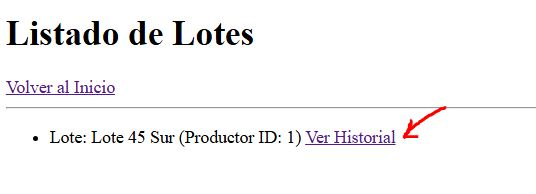
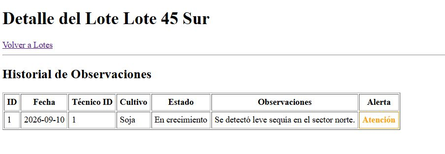

# AgroTec - Yoda Labs

**AgroTec** es un sistema backend de monitoreo agrícola desarrollado para digitalizar el registro de observaciones en lotes, reemplazando los métodos tradicionales en papel. Este proyecto está estructurado bajo el patrón MVC (Modelo-Vista-Controlador) y expone una API REST.

## Tecnologías Utilizadas

- **Entorno:** Node.js
- **Framework:** Express.js
- **Vistas:** Motor de plantillas Pug
- **Persistencia de Datos:** Archivos locales `.json` (Sistema de archivos `fs`)

## Características Principales

- **Gestión de Productores y Lotes:** API REST completa (CRUD) para registrar productores y sus lotes de campo asociados.
- **Registro de Observaciones:** Permite a los técnicos registrar observaciones detalladas vinculadas a un lote con fecha y estado.
- **Sistema de Alertas:** Clasificación de observaciones mediante niveles de alerta estrictos (`Normal`, `Atención`, `Crítico`).
- **Inmutabilidad (Soft Delete):** Las observaciones mantienen un historial persistente; al "eliminarse" se desactivan de forma lógica, sin perder la información.
- **Búsqueda Avanzada:** Filtrado dinámico de lotes según el nivel de alerta de sus observaciones.

## Instalación y Configuración

1. Clona este repositorio.
2. Abre la terminal en el directorio del proyecto y ejecuta:
   ```bash
   npm install
   ```
3. Inicia el servidor (por defecto se levantará en el puerto 3000):
   ```bash
   npm start
   ```
   _Nota: Si tienes `nodemon` instalado, puedes usar `nodemon app.js` para desarrollo._

## Documentación de Endpoints y Ejemplos

A continuación se detallan los endpoints disponibles junto con ejemplos de cómo enviar la información. Para las peticiones `POST` y `PUT`, asegúrate de enviar los datos en formato JSON (`Content-Type: application/json`).

### Productores (`/api/productores`)

- **`GET /api/productores`**
  - **Descripción:** Obtiene la lista de todos los productores.
  - **Ejemplo de Respuesta:** `[ { "id": 1, "nombre": "Estancia El Ombú", "contacto": "Juan Perez - 1122334455" } ]`

- **`GET /api/productores/:id`**
  - **Descripción:** Obtiene un productor específico por su ID.
  - **Ejemplo:** `GET /api/productores/1`

- **`POST /api/productores`**
  - **Descripción:** Crea un nuevo productor.
  - **Ejemplo de Body (JSON):**
    ```json
    {
      "nombre": "La Rural SA",
      "contacto": "info@larural.com - 555-1234"
    }
    ```

- **`PUT /api/productores/:id`**
  - **Descripción:** Actualiza los datos de un productor existente.
  - **Ejemplo:** `PUT /api/productores/1`
  - **Ejemplo de Body (JSON):**
    ```json
    {
      "nombre": "Estancia El Ombú Modificada",
      "contacto": "Juan Perez Nuevo - 1122334466"
    }
    ```

- **`DELETE /api/productores/:id`**
  - **Descripción:** Elimina un productor físicamente.
  - **Ejemplo:** `DELETE /api/productores/1`
  - **Respuesta:** `{ "mensaje": "Productor eliminado correctamente" }`

---

### Lotes (`/api/lotes`)

- **`GET /api/lotes`**
  - **Descripción:** Obtiene la lista de todos los lotes. Permite filtrado por nivel de alerta.
  - **Ejemplo de Filtrado:** `GET /api/lotes?alerta=Crítico`

- **`GET /api/lotes/:id`**
  - **Descripción:** Obtiene un lote específico por su ID.

- **`GET /api/lotes/:id/observaciones`**
  - **Descripción:** Obtiene el historial completo de observaciones asociadas a un lote específico.
  - **Ejemplo:** `GET /api/lotes/1/observaciones`

- **`POST /api/lotes`**
  - **Descripción:** Crea un nuevo lote y lo asocia a un productor existente.
  - **Ejemplo de Body (JSON):**
    ```json
    {
      "nombre_numero": "Lote 45 Sur",
      "id_productor": 1
    }
    ```

- **`PUT /api/lotes/:id`**
  - **Descripción:** Actualiza el nombre/número del lote o cambia el productor asociado.
  - **Ejemplo de Body (JSON):**
    ```json
    {
      "nombre_numero": "Lote 45 Norte"
    }
    ```

- **`DELETE /api/lotes/:id`**
  - **Descripción:** Elimina un lote físicamente.
  - **Ejemplo:** `DELETE /api/lotes/1`

---

### Observaciones (`/api/observaciones`)

- **`GET /api/observaciones`**
  - **Descripción:** Obtiene la lista de todas las observaciones registradas.

- **`GET /api/observaciones/:id`**
  - **Descripción:** Obtiene una observación específica por su ID.

- **`POST /api/observaciones`**
  - **Descripción:** Crea una nueva observación. Valida internamente que el lote y el técnico existan. El `nivel_alerta` solo acepta: "Normal", "Atención" o "Crítico".
  - **Ejemplo de Body (JSON):**
    ```json
    {
      "id_lote": 1,
      "id_tecnico": 1,
      "fecha": "2026-09-10",
      "tipo_cultivo": "Soja",
      "estado_cultivo": "En crecimiento",
      "observaciones": "Se detectó leve sequía en el sector norte.",
      "nivel_alerta": "Atención"
    }
    ```

- **`DELETE /api/observaciones/:id`**
  - **Descripción:** Aplica un borrado lógico (Soft Delete) a la observación para mantener el historial. Pasa su estado `activa` a `false`.
  - **Ejemplo:** `DELETE /api/observaciones/1`
  - **Respuesta:** `{ "mensaje": "Observación eliminada (soft delete) correctamente" }`

---

### Técnicos (`/api/tecnicos`)

- **`GET /api/tecnicos`**
  - **Descripción:** Obtiene la lista de todos los técnicos registrados.
  - **Ejemplo de Respuesta:** `[ { "id": 1, "nombre": "Juan Pérez" } ]`

- **`GET /api/tecnicos/:id`**
  - **Descripción:** Obtiene un técnico específico por su ID.
  - **Ejemplo:** `GET /api/tecnicos/1`

- **`POST /api/tecnicos`**
  - **Descripción:** Crea un nuevo técnico.
  - **Ejemplo de Body (JSON):**
    ```json
    {
      "nombre": "Roberto Sánchez"
    }
    ```

- **`PUT /api/tecnicos/:id`**
  - **Descripción:** Actualiza el nombre de un técnico existente.
  - **Ejemplo:** `PUT /api/tecnicos/1`
  - **Ejemplo de Body (JSON):**
    ```json
    {
      "nombre": "Roberto Sánchez Modificado"
    }
    ```

- **`DELETE /api/tecnicos/:id`**
  - **Descripción:** Elimina un técnico físicamente.
  - **Ejemplo:** `DELETE /api/tecnicos/1`
  - **Respuesta:** `{ "mensaje": "Técnico eliminado correctamente" }`

---

### Tipos de Cultivo (`/api/tipos-cultivo`)

- **`GET /api/tipos-cultivo`**
  - **Descripción:** Obtiene la lista de todos los tipos de cultivo registrados.
  - **Ejemplo de Respuesta:** `[ { "id": 1, "nombre": "Soja" } ]`

- **`GET /api/tipos-cultivo/:id`**
  - **Descripción:** Obtiene un tipo de cultivo específico por su ID.
  - **Ejemplo:** `GET /api/tipos-cultivo/1`

- **`POST /api/tipos-cultivo`**
  - **Descripción:** Crea un nuevo tipo de cultivo.
  - **Ejemplo de Body (JSON):**
    ```json
    {
      "nombre": "Sorgo"
    }
    ```

- **`PUT /api/tipos-cultivo/:id`**
  - **Descripción:** Actualiza el nombre de un tipo de cultivo existente.
  - **Ejemplo:** `PUT /api/tipos-cultivo/1`
  - **Ejemplo de Body (JSON):**
    ```json
    {
      "nombre": "Sorgo Modificado"
    }
    ```

- **`DELETE /api/tipos-cultivo/:id`**
  - **Descripción:** Elimina un tipo de cultivo físicamente.
  - **Ejemplo:** `DELETE /api/tipos-cultivo/1`
  - **Respuesta:** `{ "mensaje": "Tipo de cultivo eliminado correctamente" }`

## Vistas Frontend

El proyecto incluye vistas simples renderizadas desde el servidor usando Pug para interactuar rápidamente con los datos:

- **Inicio:** `http://localhost:3000/`
- **Explorador de Lotes:** `http://localhost:3000/vista/lotes`

> **Captura de Pantalla del Explorador de Lotes:**
>
> 
> 
> 
